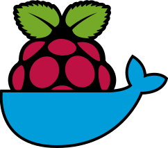

<div align="center">
	
</div>

# dockerpi

[](https://github.com/lukechilds/dockerpi/actions)
[](https://hub.docker.com/r/lukechilds/dockerpi/)
[](https://hub.docker.com/r/lukechilds/dockerpi/tags)
[](https://github.com/sponsors/lukechilds)
[](https://blockstream.info/address/3Luke2qRn5iLj4NiFrvLBu2jaEj7JeMR6w)
[](https://tippin.me/@lukechilds?refurl=github.com/lukechilds/dockerpi)

> A Virtualised Raspberry Pi inside a Docker image

Gives you access to a virtualised ARM based Raspberry Pi machine running the Raspian operating system.

This is not just a Raspian Docker image, it's a full ARM based Raspberry Pi virtual machine environment.

<div align="center">
	
</div>

## Usage

```
docker run -it lukechilds/dockerpi
```

By default all filesystem changes will be lost on shutdown. You can persist filesystem changes between reboots by mounting the `/sdcard` volume on your host:

```
docker run -it -v $HOME/.dockerpi:/sdcard lukechilds/dockerpi
```

If you have a specific image you want to mount you can mount it at `/sdcard/filesystem.img`:

```
docker run -it -v /2019-09-26-raspbian-buster-lite.img:/sdcard/filesystem.img lukechilds/dockerpi
```

If you only want to mount your own image, you can download a much slimmer VM only Docker container that doesn't contain the Raspbian filesystem image:

[](https://hub.docker.com/r/lukechilds/dockerpi/tags?name=latest)
[](https://hub.docker.com/r/lukechilds/dockerpi/tags?name=vm)

```
docker run -it -v /2019-09-26-raspbian-buster-lite.img:/sdcard/filesystem.img lukechilds/dockerpi:vm
```

## Which machines are supported?

By default a Raspberry Pi 1 is virtualised, however experimental support has been added for Pi 2 and Pi 3 machines.

You can specify a machine by passing the name as a CLI argument:

```
docker run -it lukechilds/dockerpi pi1
docker run -it lukechilds/dockerpi pi2
docker run -it lukechilds/dockerpi pi3
```

> **Note:** In the Pi 2 and Pi 3 machines, QEMU hangs once the machines are powered down requiring you to `docker kill` the container. See [#4](https://github.com/lukechilds/dockerpi/pull/4) for details.


## Wait, what?

A full ARM environment is created by using Docker to bootstrap a QEMU virtual machine. The Docker QEMU process virtualises a machine with a single core ARM11 CPU and 256MB RAM, just like the Raspberry Pi. The official Raspbian image is mounted and booted along with a modified QEMU compatible kernel.

You'll see the entire boot process logged to your TTY until you're prompted to log in with the username/password pi/raspberry.

```
pi@raspberrypi:~$ uname -a
Linux raspberrypi 4.19.50+ #1 Tue Nov 26 01:49:16 CET 2019 armv6l GNU/Linux
pi@raspberrypi:~$ cat /etc/os-release | head -n 1
PRETTY_NAME="Raspbian GNU/Linux 10 (buster)"
pi@raspberrypi:~$ cat /proc/cpuinfo
processor       : 0
model name      : ARMv6-compatible processor rev 7 (v6l)
BogoMIPS        : 798.31
Features        : half thumb fastmult vfp edsp java tls
CPU implementer : 0x41
CPU architecture: 7
CPU variant     : 0x0
CPU part        : 0xb76
CPU revision    : 7

Hardware        : ARM-Versatile (Device Tree Support)
Revision        : 0000
Serial          : 0000000000000000
pi@raspberrypi:~$ free -h
              total        used        free      shared  buff/cache   available
Mem:          246Mi        20Mi       181Mi       1.0Mi        44Mi       179Mi
Swap:          99Mi          0B        99Mi
```

## Build

Build this image yourself by checking out this repo, `cd` ing into it and running:

```
docker build -t lukechilds/dockerpi .
```

Build the VM only image with:

```
docker build -t lukechilds/dockerpi:vm --target dockerpi-vm .
```

## Credit

Thanks to [@dhruvvyas90](https://github.com/dhruvvyas90) for his [dhruvvyas90/qemu-rpi-kernel](https://github.com/dhruvvyas90/qemu-rpi-kernel) repo.

## License

MIT © Luke Childs
